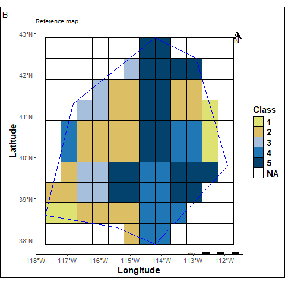
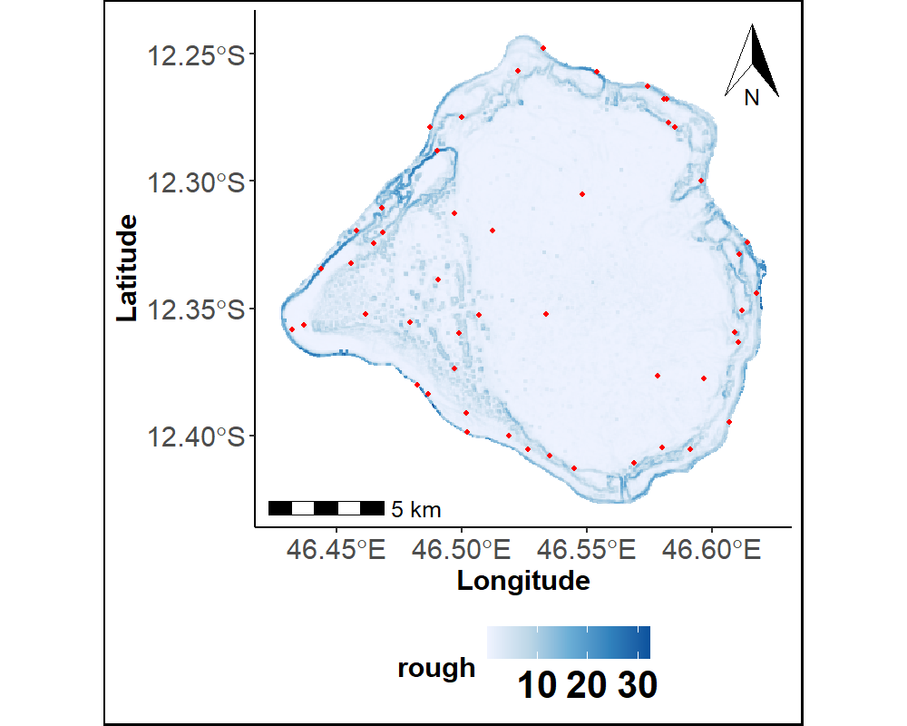

::: column-screen
```{=html}
<link rel="stylesheet" href="assets/v8.css">
<style>
.v8 .hero{position:relative;overflow:hidden;padding:80px 20px 64px}
.v8 #netbg{position:absolute;inset:0;width:100%;height:100%;pointer-events:none;z-index:0}
.v8 .herotext{position:relative;z-index:1}
.v8 .hero .h1{background:linear-gradient(100deg,var(--txt) 45%,var(--blue));-webkit-background-clip:text;background-clip:text;color:transparent}
.v8 .herohome .h1{font-size:64px}
.v8 .herokicker{display:inline-flex;align-items:center;gap:10px;font-size:16px;font-weight:700;text-transform:uppercase;letter-spacing:.12em;color:var(--coral);margin:14px 0 0}
.v8 .herokicker::before{content:"";width:26px;height:2px;background:var(--coral)}
.v8 .roleline{font-family:ui-monospace,"SFMono-Regular",Consolas,monospace;font-size:21px;font-weight:700;margin:8px 0 22px;min-height:1.3em;text-align:center}
.v8 .roleline::after{content:"";display:inline-block;width:8px;height:1.1em;background:currentColor;margin-left:2px;vertical-align:-2px;animation:caret 1s step-end infinite}
@keyframes caret{50%{opacity:0}}

.v8 .herotext>*{opacity:0;animation:heroIn .6s ease forwards}
.v8 .herotext>*:nth-child(1){animation-delay:.05s}
.v8 .herotext>*:nth-child(2){animation-delay:.15s}
@keyframes heroIn{from{opacity:0;transform:translateY(10px)}to{opacity:1;transform:translateY(0)}}
@media (prefers-reduced-motion:reduce){.v8 .roleline::after{animation:none}.v8 .herotext>*{opacity:1;animation:none}}
.v8 .panel3 .roleline{font-size:18px;margin:0 0 32px}

.v8 .hubtitle{font-size:22px;font-weight:700;color:var(--txt);margin:0}
.v8 .hubdesc{font-size:13.5px;color:var(--muted);line-height:1.65;margin:0;max-width:32ch}
.v8 .hubarrow{position:relative;z-index:2;font-size:12.5px;font-weight:600;color:var(--hc);display:inline-flex;align-items:center;gap:6px;text-decoration:none;transition:transform .15s ease}
.v8 .hubarrow i{transition:transform .18s}
.v8 .hubarrow:hover i{transform:translateX(3px)}

.v8 .hubminibadge{display:inline-block;font-size:10.5px;font-weight:700;text-transform:uppercase;letter-spacing:.04em;padding:3px 8px;border-radius:8px;margin-right:5px;border:1px solid currentColor}
.v8 .showtags{margin:0 0 10px}

.v8 .reveal.pending{opacity:0;transform:translateY(16px);transition:opacity .5s ease,transform .5s ease}
.v8 .reveal.pending.show{opacity:1;transform:none}

/* Trois panneaux Portfolio / Tutoriels / Blog, alternés et bien séparés */
.v8 .panel3{padding:72px 20px;position:relative}
.v8 .panel3:nth-of-type(odd){background:var(--panel)}
.v8 .panelinner{max-width:1000px;margin:0 auto}
.v8 .panelhead{display:flex;align-items:center;justify-content:center;gap:12px;margin:0 0 10px}
.v8 .panelhead i{font-size:22px;color:var(--hc)}
.v8 .panelhead span{font-size:27px;font-weight:700;letter-spacing:-.01em;color:var(--txt)}
.v8 .panelhint{text-align:center;font-size:13px;color:var(--muted);margin:0 auto 40px;max-width:60ch}
.v8 .panelcta{text-align:center;margin:24px 0 0}
.v8 .showstat i{font-size:30px}
.v8 .showrow.soon{cursor:default}
.v8 .showrow.soon .showstat{color:var(--hc)}

.v8 .subled{max-width:640px;margin:0 auto 34px;padding:0 20px;text-align:center;font-size:15px;color:var(--muted)}

/* Vitrines éditoriales (Travaux / Tutoriels / Blog) : le CADRE de chaque palette
   est lui-même la forme du groupe — cercle (Portfolio), hexagone (Tutoriels),
   pentagone (Blog) — et non un simple médaillon interne. */
.v8 .showcase{position:relative;z-index:1;width:100%;max-width:900px;margin:0 auto;display:grid;grid-template-columns:repeat(2,minmax(0,1fr));gap:30px;justify-items:center}
/* .showrow = plaque de couleur pleine (le contour) ; .showcontent = plaque intérieure
   décalée de l'épaisseur du contour, qui porte le vrai contenu — un clip-path
   appliqué avec `border` ne dessine pas un trait continu sur les arêtes vives
   d'un hexagone/pentagone, donc le "contour" est simulé par calque plutôt que bordé. */
.v8 .showrow{position:relative;display:block;width:100%;max-width:380px;aspect-ratio:1;background:var(--hc);text-decoration:none;color:inherit;transition:transform .25s ease,box-shadow .25s ease}
.v8 .showrow:hover{transform:translateY(-4px) scale(1.015);box-shadow:0 22px 44px -22px rgba(0,0,0,.55)}
.v8 .showcontent{position:absolute;inset:4px;overflow:hidden;display:flex;flex-direction:column;align-items:center;justify-content:center;text-align:center;padding:11% 14%;background:var(--panel);transition:background .2s ease}
.v8 .panel3:nth-of-type(odd) .showcontent{background:var(--bg)}
.v8 .showrow:hover .showcontent{background:color-mix(in srgb, var(--hc) 8%, var(--panel))}
.v8 .panel3:nth-of-type(odd) .showrow:hover .showcontent{background:color-mix(in srgb, var(--hc) 8%, var(--bg))}
.v8 .shownum{display:block;font-size:36px;font-weight:700;color:var(--hc);letter-spacing:-.02em;line-height:1}
.v8 .showsub{display:block;font-size:12.5px;color:var(--muted);margin-top:6px;line-height:1.3}
.v8 .showimg{width:108px;height:108px;border-radius:6px;overflow:hidden;background:#fff;margin:0 0 10px}
.v8 .showimg img,.v8 .showimg svg{width:100%;height:100%;object-fit:cover;display:block}
.v8 .showimg svg{color:var(--hc);padding:16px;box-sizing:border-box}
.v8 .showbody{display:flex;flex-direction:column;align-items:center;min-width:0}
.v8 .showtitle{font-size:16.5px;font-weight:700;color:var(--txt);margin:0 0 6px;letter-spacing:-.01em;line-height:1.25}
.v8 .showdesc{font-size:12px;color:var(--muted);line-height:1.4;margin:0 0 8px}
.v8 .showtags{display:flex;justify-content:center;margin:0 0 7px}
.v8 .hubarrow{font-size:13px}

/* Portfolio : cercle */
.v8 .showrow.stat,.v8 .showrow.stat .showcontent{border-radius:50%}

/* Tutoriels : hexagone */
.v8 .showrow.media,.v8 .showrow.media .showcontent{clip-path:polygon(25% 0%,75% 0%,100% 50%,75% 100%,25% 100%,0% 50%)}

/* Blog : pentagone (pointe en haut, un peu plus de marge côté sommet) */
.v8 .showrow.teaser,.v8 .showrow.teaser .showcontent{clip-path:polygon(50% 0%,100% 38%,82% 100%,18% 100%,0% 38%)}
.v8 .showrow.teaser .showcontent{padding-top:22%}
.v8 .showrow.soon{cursor:default}

@media (max-width:560px){.v8 .showcase{grid-template-columns:1fr;max-width:320px}}
</style>
<div class="v8" id="v8">

<div class="hero herohome">
<canvas id="netbg" aria-hidden="true"></canvas>
<div class="herotext">
<p class="idtag reveal" data-title-en="Paul Faye — Data Scientist, Ph.D."><span class="idpunc">&lt;</span><span class="idname">Paul Faye</span> <span class="idattr">role</span><span class="idpunc">=</span><span class="idval">&quot;Data scientist, Ph.D.&quot;</span><span class="idpunc"> /&gt;</span></p>
<div class="pillarrow reveal">
<a class="pillshape circle c-portfolio" href="portfolio.qmd"><span class="pillshapeinner"><i class="bi bi-person-badge"></i><span data-en="Portfolio">Portfolio</span></span></a>
<a class="pillshape hexagon c-tutoriels" href="tutoriels.qmd"><span class="pillshapeinner"><i class="bi bi-journal-code"></i><span data-en="Tutorials">Tutoriels</span></span></a>
<a class="pillshape pentagon c-blog" href="blog.qmd"><span class="pillshapeinner"><i class="bi bi-pencil-square"></i><span data-en="Blog">Blog</span></span></a>
</div>
</div>
</div>

<section class="panel3">
<div class="panelinner">
<p class="panelhead reveal"><i class="bi bi-person-badge" style="color:var(--blue)" aria-hidden="true"></i><span>Portfolio</span></p>
<p class="panelhint reveal" data-en="Designing, validating, and industrializing statistical models — the strictly professional part of the site: career path and research work.">Conception, validation et industrialisation de modèles statistiques — la partie strictement professionnelle du site : parcours et travaux de recherche.</p>
<p class="roleline reveal" id="roleTypePortfolio" style="color:var(--blue)"></p>
<div class="showcase">
<a class="showrow stat reveal" href="parcours.qmd" style="--hc:var(--blue)">
<div class="showcontent">
<div class="showimg"><svg viewBox="0 0 64 64" fill="none" xmlns="http://www.w3.org/2000/svg" aria-hidden="true"><path d="M6 52 L20 40 L34 46 L58 12" stroke="currentColor" stroke-width="4" stroke-linecap="round" stroke-linejoin="round"/><circle cx="6" cy="52" r="4.5" fill="currentColor"/><circle cx="20" cy="40" r="4.5" fill="currentColor"/><circle cx="34" cy="46" r="4.5" fill="currentColor"/><circle cx="58" cy="12" r="4.5" fill="currentColor"/></svg></div>
<div class="showstat"><span class="shownum" data-en="6 years">6 ans</span><span class="showsub" data-en="of experience">d'expérience</span></div>
<div class="showbody">
<p class="showtitle" data-en="Career path">Parcours</p>
<span class="hubarrow"><span data-en="View">Voir</span> <i class="bi bi-arrow-right"></i></span>
</div>
</div>
</a>
<a class="showrow stat reveal" href="projets.qmd" style="--hc:var(--blue)">
<div class="showcontent">
<div class="showimg"><svg viewBox="0 0 64 64" fill="none" xmlns="http://www.w3.org/2000/svg" aria-hidden="true"><rect x="8" y="34" width="12" height="22" rx="2" fill="currentColor" opacity=".55"/><rect x="26" y="20" width="12" height="36" rx="2" fill="currentColor" opacity=".8"/><rect x="44" y="8" width="12" height="48" rx="2" fill="currentColor"/></svg></div>
<div class="showstat"><span class="shownum">3</span><span class="showsub" data-en="projects delivered">projets livrés</span></div>
<div class="showbody">
<p class="showtitle" data-en="Work">Travaux</p>
<span class="hubarrow"><span data-en="View">Voir</span> <i class="bi bi-arrow-right"></i></span>
</div>
</div>
</a>
</div>
<p class="panelcta reveal"><a class="hubarrow" style="--hc:var(--blue)" href="portfolio.qmd"><span data-en="View the portfolio">Voir le portfolio</span> <i class="bi bi-arrow-right"></i></a></p>
</div>
</section>

<section class="panel3">
<div class="panelinner">
<p class="panelhead reveal"><i class="bi bi-journal-code" style="color:var(--coral)" aria-hidden="true"></i><span data-en="Tutorials">Tutoriels</span></p>
<p class="panelhint reveal" data-en="Complete notebooks, in Python and R, from preprocessing to validation — not just the result, the whole approach.">Des notebooks complets, en Python et en R, du prétraitement à la validation — pas seulement le résultat, toute la démarche.</p>
<p class="roleline reveal" id="roleTypeTutoriels" style="color:var(--coral)"></p>
<div class="showcase">
<a class="showrow media reveal" href="tutoriels/comparer-cartes/comparer-cartes.html" style="--hc:var(--coral)">
<div class="showcontent">
<div class="showimg"></div>
<div class="showbody">
<p class="showtitle" data-en="Compare maps">Comparer des cartes</p>
<div class="showtags"><span class="hubminibadge" style="color:var(--blue)">Python</span><span class="hubminibadge" style="color:var(--coral)">R</span></div>
<span class="hubarrow"><span data-en="Read">Lire</span> <i class="bi bi-arrow-right"></i></span>
</div>
</div>
</a>
<a class="showrow media reveal" href="tutoriels/echantillonnage/echantillonnage.html" style="--hc:var(--coral)">
<div class="showcontent">
<div class="showimg"></div>
<div class="showbody">
<p class="showtitle" data-en="Sampling methods">Méthodes d'échantillonnage</p>
<div class="showtags"><span class="hubminibadge" style="color:var(--blue)">Python</span><span class="hubminibadge" style="color:var(--coral)">R</span></div>
<span class="hubarrow"><span data-en="Read">Lire</span> <i class="bi bi-arrow-right"></i></span>
</div>
</div>
</a>
</div>
<p class="panelcta reveal"><a class="hubarrow" style="--hc:var(--coral)" href="tutoriels.qmd"><span data-en="View the tutorials">Voir les tutoriels</span> <i class="bi bi-arrow-right"></i></a></p>
</div>
</section>

<section class="panel3">
<div class="panelinner">
<p class="panelhead reveal"><i class="bi bi-pencil-square" style="color:var(--third)" aria-hidden="true"></i><span>Blog</span></p>
<p class="panelhint reveal" data-en="What I'm learning and what I'm building, alongside data: Data & Tech, Finance & Investing, Projects & Build — the first articles are coming.">Ce que j'apprends et ce que je construis, aux côtés de la data : Data & Tech, Finance & Investissement, Projets & Build — les premiers articles arrivent.</p>
<p class="roleline reveal" id="roleTypeBlog" style="color:var(--third)"></p>
<div class="showcase">
<div class="showrow teaser soon reveal" style="--hc:var(--third)">
<div class="showcontent">
<div class="showimg"><svg viewBox="0 0 64 64" fill="none" xmlns="http://www.w3.org/2000/svg" aria-hidden="true"><polyline points="6,50 20,38 30,44 44,22 58,10" stroke="currentColor" stroke-width="4" stroke-linecap="round" stroke-linejoin="round"/><polygon points="58,10 45,13 55,23" fill="currentColor"/></svg></div>
<div class="showbody">
<p class="showtitle" data-en="Finance & Investing">Finance & Investissement</p>
<span class="hubminibadge" style="color:var(--third)" data-en="Soon">Bientôt</span>
</div>
</div>
</div>
<div class="showrow teaser soon reveal" style="--hc:var(--third)">
<div class="showcontent">
<div class="showimg"><svg viewBox="0 0 64 64" fill="none" xmlns="http://www.w3.org/2000/svg" aria-hidden="true"><rect x="7" y="7" width="21" height="21" rx="2" fill="currentColor"/><rect x="36" y="7" width="21" height="21" rx="2" fill="currentColor" opacity=".55"/><rect x="7" y="36" width="21" height="21" rx="2" fill="currentColor" opacity=".55"/><rect x="36" y="36" width="21" height="21" rx="2" fill="currentColor"/></svg></div>
<div class="showbody">
<p class="showtitle" data-en="Projects & Build">Projets & Build</p>
<span class="hubminibadge" style="color:var(--third)" data-en="Soon">Bientôt</span>
</div>
</div>
</div>
<p class="panelcta reveal"><a class="hubarrow" style="--hc:var(--third)" href="blog.qmd"><span data-en="View the blog">Voir le blog</span> <i class="bi bi-arrow-right"></i></a></p>
</div>
</section>

</div>

<script>
(function(){
var reduced = window.matchMedia("(prefers-reduced-motion: reduce)").matches;

// Lignes de mots-clés tapées à la volée, façon terminal — une par panneau,
// chacune avec sa propre liste de mots.
var typewriterGen = {};
function startTypewriter(elId, phrases){
  var el = document.getElementById(elId);
  if(!el) return;
  typewriterGen[elId] = (typewriterGen[elId]||0) + 1;
  var myGen = typewriterGen[elId];
  if(reduced){
    el.textContent = phrases[0];
    return;
  }
  var pi=0, ci=0, deleting=false;
  function tick(){
    if(typewriterGen[elId] !== myGen) return;
    var word=phrases[pi];
    if(!deleting){
      ci++; el.textContent=word.slice(0,ci);
      if(ci===word.length){ deleting=true; setTimeout(tick,1500); return; }
      setTimeout(tick,55);
    } else {
      ci--; el.textContent=word.slice(0,ci);
      if(ci===0){ deleting=false; pi=(pi+1)%phrases.length; setTimeout(tick,300); return; }
      setTimeout(tick,28);
    }
  }
  tick();
}
var TYPEWORDS_FR = {
  roleTypePortfolio: ["Data Scientist", "Ph.D.", "Enseignant", "Chercheur", "Développeur"],
  roleTypeTutoriels: ["Statistique", "Apprentissage automatique", "Big Data", "IA", "Industrialisation"],
  roleTypeBlog: ["Apprendre", "Expérimenter", "Construire", "Partager", "Curiosité"]
};
var TYPEWORDS_EN = {
  roleTypePortfolio: ["Data Scientist", "Ph.D.", "Lecturer", "Researcher", "Developer"],
  roleTypeTutoriels: ["Statistics", "Machine Learning", "Big Data", "AI", "Industrialization"],
  roleTypeBlog: ["Learning", "Experimenting", "Building", "Sharing", "Curiosity"]
};
var IMG_ALT_FR = {
  showimgCartes: "Carte géomorphologique de référence, utilisée pour illustrer la comparaison de cartes à différentes résolutions spatiales",
  showimgEch: "Carte d'échantillonnage spatial par couverture, utilisée pour illustrer les méthodes d'échantillonnage stratégique"
};
var IMG_ALT_EN = {
  showimgCartes: "Reference geomorphological map, used to illustrate the comparison of maps at different spatial resolutions",
  showimgEch: "Coverage-based spatial sampling map, used to illustrate strategic sampling methods"
};
function applyHomeLang(lang){
  var words = lang==="en" ? TYPEWORDS_EN : TYPEWORDS_FR;
  Object.keys(words).forEach(function(id){ startTypewriter(id, words[id]); });
  var alts = lang==="en" ? IMG_ALT_EN : IMG_ALT_FR;
  Object.keys(alts).forEach(function(id){
    var img = document.getElementById(id);
    if(img) img.setAttribute("alt", alts[id]);
  });
}
applyHomeLang((window.localStorage && localStorage.getItem("site-lang")) || "fr");
window.addEventListener("sitelangchange", function(e){ applyHomeLang(e.detail.lang); });

// Réseau de points en fond du hero : ambiance "data", très en sourdine.
var canvas = document.getElementById("netbg");
if(canvas && canvas.getContext){
  var hero = canvas.closest(".hero");
  var ctx = canvas.getContext("2d");
  var accent = getComputedStyle(document.getElementById("v8")).getPropertyValue("--blue").trim() || "#5B8FE8";
  var nodes = [], N = 32, maxD = 130;
  function resize(){
    canvas.width = hero.offsetWidth;
    canvas.height = hero.offsetHeight;
  }
  function initNodes(){
    nodes = [];
    for(var i=0;i<N;i++){
      nodes.push({x:Math.random()*canvas.width, y:Math.random()*canvas.height,
        vx:(Math.random()-0.5)*0.16, vy:(Math.random()-0.5)*0.16});
    }
  }
  function frame(){
    ctx.clearRect(0,0,canvas.width,canvas.height);
    nodes.forEach(function(n){
      if(!reduced){
        n.x+=n.vx; n.y+=n.vy;
        if(n.x<0||n.x>canvas.width) n.vx*=-1;
        if(n.y<0||n.y>canvas.height) n.vy*=-1;
      }
    });
    ctx.strokeStyle = accent; ctx.lineWidth = 1;
    for(var i=0;i<nodes.length;i++){
      for(var j=i+1;j<nodes.length;j++){
        var dx=nodes[i].x-nodes[j].x, dy=nodes[i].y-nodes[j].y, d=Math.sqrt(dx*dx+dy*dy);
        if(d<maxD){
          ctx.globalAlpha = (1-d/maxD)*0.16;
          ctx.beginPath(); ctx.moveTo(nodes[i].x,nodes[i].y); ctx.lineTo(nodes[j].x,nodes[j].y); ctx.stroke();
        }
      }
    }
    ctx.fillStyle = accent; ctx.globalAlpha = 0.4;
    nodes.forEach(function(n){ ctx.beginPath(); ctx.arc(n.x,n.y,1.6,0,Math.PI*2); ctx.fill(); });
    ctx.globalAlpha = 1;
    if(!reduced) requestAnimationFrame(frame);
  }
  window.addEventListener("resize", function(){ resize(); if(reduced) frame(); });
  resize(); initNodes(); frame();
}

// Apparition douce des blocs au défilement.
if(!reduced){
  var els = document.querySelectorAll(".reveal");
  els.forEach(function(e){ e.classList.add("pending"); });
  if("IntersectionObserver" in window){
    var io = new IntersectionObserver(function(entries){
      entries.forEach(function(en){
        if(en.isIntersecting){ en.target.classList.add("show"); io.unobserve(en.target); }
      });
    }, {threshold:.15});
    els.forEach(function(e){ io.observe(e); });
  } else {
    els.forEach(function(e){ e.classList.add("show"); });
  }
}

// Boutons magnétiques : légère attraction vers le curseur à l'approche.
if(!reduced){
  document.querySelectorAll(".btn, .hubarrow, .iconbtn, .pillshape").forEach(function(btn){
    btn.addEventListener("mousemove", function(e){
      var r = btn.getBoundingClientRect();
      var mx = e.clientX - (r.left + r.width / 2), my = e.clientY - (r.top + r.height / 2);
      btn.style.transform = "translate(" + (mx * 0.18).toFixed(1) + "px," + (my * 0.18).toFixed(1) + "px)";
    });
    btn.addEventListener("mouseleave", function(){ btn.style.transform = ""; });
  });
}
})();
</script>
```
:::