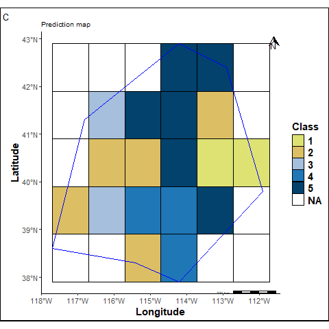
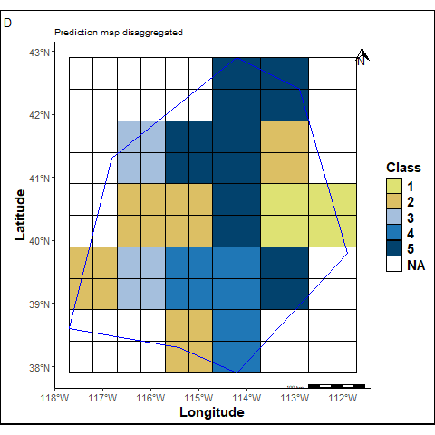
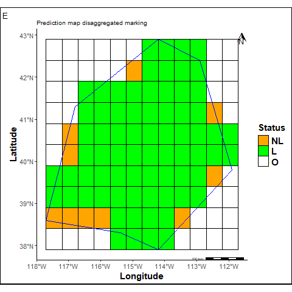
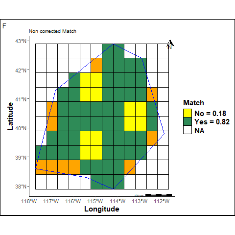
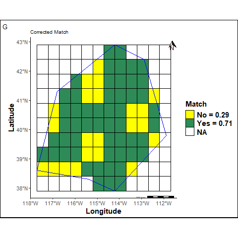

```{=html}
<style>
nav.navbar{display:none !important}
body.nav-fixed{padding-top:0 !important}
.lang-python{display:none}
body[data-lang="python"] .lang-r{display:none}
body[data-lang="python"] .lang-python{display:block}

:root{--lr-r:#5B8FE8;--lr-py:#E3B341}
body.quarto-light{--lr-r:#2F63C7;--lr-py:#9A6700}
.langtoggle{position:sticky;top:12px;z-index:40;display:inline-flex;padding:4px;border-radius:999px;background:rgba(127,127,127,.1);border:1px solid rgba(127,127,127,.22);box-shadow:0 8px 20px -12px rgba(0,0,0,.35);margin:18px 0 26px}
.langtoggle-indicator{position:absolute;top:4px;bottom:4px;left:4px;width:calc(50% - 4px);border-radius:999px;background:var(--bs-body-bg,#fff);box-shadow:0 2px 8px rgba(0,0,0,.18);transition:transform .28s cubic-bezier(.22,.8,.32,1);z-index:0}
.langtoggle button{position:relative;z-index:1;border:none;background:transparent;padding:8px 24px;border-radius:999px;font-size:13.5px;font-weight:600;cursor:pointer;color:inherit;opacity:.55;transition:opacity .2s;display:inline-flex;align-items:center;gap:8px}
.langtoggle button::before{content:"";width:7px;height:7px;border-radius:50%;flex:none}
.langtoggle button[data-lang="r"]::before{background:var(--lr-r)}
.langtoggle button[data-lang="python"]::before{background:var(--lr-py)}
.langtoggle button[aria-pressed="true"]{opacity:1}
</style>
<script>
document.addEventListener("DOMContentLoaded", function(){
  var h = window.location.hash.replace("#","").toLowerCase();
  var initial = h==="python" ? "python" : "r";
  var wrap = document.querySelector(".langtoggle");
  var indicator = document.getElementById("langIndicator");
  var buttons = document.querySelectorAll(".langtoggle button");
  function setLang(lang){
    document.body.setAttribute("data-lang", lang);
    buttons.forEach(function(b){ b.setAttribute("aria-pressed", b.getAttribute("data-lang")===lang); });
    indicator.style.transform = lang==="python" ? "translateX(100%)" : "translateX(0)";
  }
  buttons.forEach(function(b){
    b.addEventListener("click", function(){ setLang(b.getAttribute("data-lang")); });
  });
  setLang(initial);
});
</script>
<script>
(function(){
  var PAIR = {fr: "comparer-cartes.html", en: "comparer-cartes-en.html"};
  var THIS_LANG = "en";
  var firstLangEvent = true;
  window.addEventListener("sitelangchange", function(e){
    if(firstLangEvent){ firstLangEvent = false; return; }
    if(e.detail.lang !== THIS_LANG){
      window.location.href = PAIR[e.detail.lang] + window.location.hash;
    }
  });
})();
</script>
```

[← Back to tutorials](../../tutoriels.qmd)

## The problem

Two geomorphological maps obtained at different spatial resolutions cannot be compared cell by cell as they are: the predicted map must first be brought down to the resolution of the reference map, and only then can their agreement be measured — without settling for a single overall score, which would favor majority classes.

The code and functions used here are the ones employed to validate the model presented in [“Large-scale mapping”](../../projets.qmd) on the Work page. Pick the language you're interested in below — the method and the results are the same, only the code (and sometimes the figure) differs.

```{=html}
<div class="langtoggle" role="group" aria-label="Choose language">
<span class="langtoggle-indicator" id="langIndicator"></span>
<button type="button" data-lang="r" aria-pressed="true">R</button>
<button type="button" data-lang="python" aria-pressed="false">Python</button>
</div>
```

::: {.callout-note title="In short"}
- The predicted map is **disaggregated** to recover the resolution of the reference map, cell by cell.
- **Match score**: proportion of identical cells between the two maps.
- **Balanced Match score**: average of per-class recalls — each class counts as much as the others, regardless of its frequency.
- In the example below, the balanced score goes from **0.86** to **0.56** depending on how unpredicted cells are counted — that gap alone illustrates why the choice of metric matters.
:::

## The method

A study area is delineated then discretized into a grid. The predicted map — produced at a coarser resolution — is disaggregated to recover the resolution of the reference map, and each cell is classified by status: out of area, predicted, or unpredicted.

::: {.lang-block .lang-r}

::: {.callout-tip collapse="true" title="Technical prerequisites"}
R packages: `ggplot2`, `dplyr`, `stringr`, `sp`, `sf`, `ggspatial`, `ggpubr`, `ggnewscale`, `raster`. The 4 functions used here (disaggregation, cell status, match score, balanced score) are published separately on Zenodo so they can be reused independently of this notebook.

[<i class="bi bi-box-arrow-up-right"></i> Functions on Zenodo](https://doi.org/10.5281/zenodo.8436795){.btn .btn-outline-primary role="button" target="_blank"}
:::

```r
library(ggplot2)
library(sp)
library(sf)
library(raster)

# Study area: WGS84 polygon discretized into a grid
crdref <- CRS('+proj=longlat +datum=WGS84')
lon <- c(-116.8, -114.2, -112.9, -111.9, -114.2, -115.4, -117.7)
lat <- c(41.3, 42.9, 42.4, 39.8, 37.9, 38.3, 38.6)
pols <- Polygons(list(Polygon(cbind(lon, lat))), ID = "1")
pols <- SpatialPolygons(list(pols), proj4string = crdref)

ref_sp <- raster(xmn = extent(pols)[1], xmx = extent(pols)[2],
                  ymn = extent(pols)[3], ymx = extent(pols)[4], res = c(.5, .5))
crs(ref_sp) <- crdref

# Reference map (fine resolution, 5 classes) and predicted map (coarse resolution)
r <- raster(xmn = extent(pols)[1], xmx = extent(pols)[2],
            ymn = extent(pols)[3], ymx = extent(pols)[4], res = c(1, 1))
set.seed(12)
values(r) <- sample(1:5, ncell(r), replace = TRUE)
values(ref_sp) <- values(raster::disaggregate(r, fact = 2))
ref_sp_mask <- mask(ref_sp, pols, updateNA = TRUE)

pred_sp <- r
pred_sp[[1]][c(9, 17, 21)] <- c(5, 1, 4)
pred_sp_mask <- mask(pred_sp, pols, updateNA = TRUE)

# Disaggregating the predicted map + cell status (out of area / predicted / unpredicted)
source('disaggregate.R'); source('status-prop.R')
pred_sp_dis <- disagRast(pols, pred_sp_mask, ref_sp, crdref)

ref_spbis <- ref_sp
ref_spbis[is.na(ref_spbis)] <- 999
outstudy <- mask(ref_spbis, pols, updateNA = TRUE)
status <- statusProp(pred_sp_dis, ref_sp, outstudy[[1]], pols, 4326)
PropNL <- status[[4]]  # proportion of unpredicted cells
PropL  <- status[[5]]  # proportion of predicted cells
```

::: {layout-ncol="4"}







:::

From reference to status map: the predicted map (coarse resolution) is disaggregated to recover the resolution of the reference map, then every cell in the study area is classified as out of area, predicted (green), or unpredicted (orange). In this example, 45 cells are out of area, and of the remaining 82, 72 are predicted (88%) versus 10 unpredicted (12%) — this last proportion is what drives the gap between the raw and corrected scores below.

> Disaggregating the predicted map produces edge effects at the periphery of the study area — visible on the status map above.

:::

::: {.lang-block .lang-python}

::: {.callout-tip collapse="true" title="Technical prerequisites"}
Only `numpy` and `matplotlib` are needed — no `geopandas`/`shapely`/`rasterio`: the point-in-polygon test uses `matplotlib.path.Path`, and the grids are plain numpy arrays. Full code: [`compare_maps.py`](compare_maps.py).
:::

```{python}
#| label: methode
import numpy as np
import matplotlib.pyplot as plt
from matplotlib.path import Path
from matplotlib.colors import ListedColormap, BoundaryNorm

# Study area
POLY_LON = [-116.8, -114.2, -112.9, -111.9, -114.2, -115.4, -117.7]
POLY_LAT = [41.3, 42.9, 42.4, 39.8, 37.9, 38.3, 38.6]
POLYGON = np.column_stack([POLY_LON, POLY_LAT])
XMIN, XMAX, YMIN, YMAX = -117.7, -111.9, 37.9, 42.9
NA = np.nan

# Reference map (fine, 10x12) and predicted map (coarse, 5x6)
REFERENCE = np.array([
    [NA, NA, NA, NA, NA, NA,  5,  5, NA, NA, NA, NA],
    [NA, NA, NA, NA, NA,  3,  5,  5,  5,  5, NA, NA],
    [NA, NA, NA,  3,  2,  2,  5,  5,  2,  2, NA, NA],
    [NA, NA,  3,  3,  2,  2,  5,  5,  2,  2,  1, NA],
    [NA,  4,  2,  2,  2,  2,  5,  5,  4,  4,  1, NA],
    [NA,  4,  2,  2,  2,  2,  5,  5,  4,  4,  1, NA],
    [NA,  2,  3,  3,  5,  5,  4,  4,  5,  5,  5, NA],
    [ 2,  2,  3,  3,  5,  5,  4,  4,  5,  5, NA, NA],
    [ 1,  1,  2,  2,  2,  2,  4,  4,  4, NA, NA, NA],
    [NA, NA, NA, NA, NA, NA,  4,  4, NA, NA, NA, NA],
], dtype=float)

PRED_COARSE = np.array([
    [NA, NA, NA,  5,  5, NA],
    [NA,  3,  5,  5,  2, NA],
    [NA,  2,  2,  5,  1,  1],
    [ 2,  3,  4,  4,  5, NA],
    [NA, NA,  2,  4, NA, NA],
], dtype=float)

def cell_polygon_mask(xs, ys, polygon):
    """True for cells whose center lies inside the polygon."""
    xx, yy = np.meshgrid(xs, ys)
    pts = np.column_stack([xx.ravel(), yy.ravel()])
    return Path(polygon).contains_points(pts).reshape(len(ys), len(xs))

def disaggregate(coarse, factor):
    """Disaggregates a coarse grid by repeating each cell factor x factor times."""
    return np.repeat(np.repeat(coarse, factor, axis=0), factor, axis=1)

xs_f = XMIN + 0.5 * (np.arange(12) + 0.5)
ys_f = YMAX - 0.5 * (np.arange(10) + 0.5)
mask_ref = cell_polygon_mask(xs_f, ys_f, POLYGON)

reference = np.where(mask_ref, REFERENCE, np.nan)
predicted = np.where(mask_ref, disaggregate(PRED_COARSE, 2), np.nan)
```

```{python}
#| label: fig-methode
#| fig-cap: "From reference to disaggregated predicted map"
#| code-fold: true
CLASS_COLORS = ["#dee273", "#dcbf64", "#a5bfdd", "#1f77b6", "#02426d"]

def plot_class(ax, grid, title):
    cmap = ListedColormap(CLASS_COLORS)
    norm = BoundaryNorm(np.arange(0.5, 6.5, 1), cmap.N)
    ax.pcolormesh(np.linspace(XMIN, XMAX, grid.shape[1] + 1),
                  np.linspace(YMAX, YMIN, grid.shape[0] + 1),
                  np.ma.masked_invalid(grid), cmap=cmap, norm=norm,
                  edgecolors="black", linewidth=0.3)
    ax.plot(np.append(POLY_LON, POLY_LON[0]), np.append(POLY_LAT, POLY_LAT[0]), color="blue", linewidth=1)
    ax.set_title(title, fontsize=10)
    ax.set_xticks([]); ax.set_yticks([])

fig, axes = plt.subplots(1, 3, figsize=(11, 4))
plot_class(axes[0], reference, "Reference (fine)")
plot_class(axes[1], PRED_COARSE, "Predicted (coarse)")
plot_class(axes[2], predicted, "Predicted, disaggregated")
fig.tight_layout()
plt.show()
```

:::

## The results

Two families of scores measure agreement between the two maps: a simple **match score** (proportion of identical cells), and a **per-class balanced score** that neutralizes the effect of dominant classes [per @grandini2020metrics]. Each comes in an *uncorrected* version (which ignores unpredicted cells) and one or two *corrected* versions (which count them as errors, more or less severely).

::: {.lang-block .lang-r}

| Score | Value | What it measures |
|---|---|---|
| Match — uncorrected | **0.82** | Identical cells, unpredicted cells ignored |
| Match — corrected | **0.71** | Same, unpredicted cells counted as errors |
| Balanced Match — raw (NCBM) | **0.86** | Average of per-class recalls, unpredicted cells ignored |
| Balanced Match — corrected, prop. 1 | **0.76** | NCBM penalized by the proportion of unpredicted cells |
| Balanced Match — corrected, prop. 2 | **0.56** | Unpredicted cells reintegrated, recall set to 0 |

::: {layout-ncol="2"}



:::

:::

::: {.lang-block .lang-python}

```{python}
#| label: scores
def match_score(pred, ref, mask, correct=False):
    valid_ref = mask & ~np.isnan(ref)
    if correct:
        return float((valid_ref & (pred == ref)).sum() / valid_ref.sum())
    valid = valid_ref & ~np.isnan(pred)
    return float(np.mean(pred[valid] == ref[valid]))

def balanced_match(pred, ref, mask, classes):
    valid_ref = mask & ~np.isnan(ref)
    valid_pred = valid_ref & ~np.isnan(pred)
    recalls_ncbm, recalls_cbm2 = [], []
    for k in classes:
        idx_pred = valid_pred & (ref == k)
        if idx_pred.sum() > 0:
            recalls_ncbm.append(float((idx_pred & (pred == k)).sum() / idx_pred.sum()))
        idx_ref = valid_ref & (ref == k)
        if idx_ref.sum() > 0:
            recalls_cbm2.append(float((idx_ref & (pred == k)).sum() / idx_ref.sum()))
    n_L = (mask & ~np.isnan(pred)).sum()
    n_NL = (mask & np.isnan(pred) & ~np.isnan(ref)).sum()
    ncbm = float(np.mean(recalls_ncbm))
    cbm1 = ncbm * (n_L / (n_L + n_NL))
    cbm2 = float(sum(recalls_cbm2) / (len(recalls_cbm2) + 1))
    return ncbm, cbm1, cbm2

match_nc = match_score(predicted, reference, mask_ref, correct=False)
match_c = match_score(predicted, reference, mask_ref, correct=True)
ncbm, cbm1, cbm2 = balanced_match(predicted, reference, mask_ref, [1, 2, 3, 4, 5])

print(f"Uncorrected match : {match_nc:.2f}")
print(f"Corrected match    : {match_c:.2f}")
print(f"NCBM (raw)         : {ncbm:.2f}")
print(f"CBM1 (corrected, prop. 1) : {cbm1:.2f}")
print(f"CBM2 (corrected, prop. 2) : {cbm2:.2f}")
```

| Score | Value | What it measures |
|---|---|---|
| Match — uncorrected | **0.81** | Identical cells, unpredicted cells ignored |
| Match — corrected | **0.70** | Same, unpredicted cells counted as errors |
| Balanced Match — raw (NCBM) | **0.86** | Average of per-class recalls, unpredicted cells ignored |
| Balanced Match — corrected, prop. 1 | **0.74** | NCBM penalized by the proportion of unpredicted cells |
| Balanced Match — corrected, prop. 2 | **0.56** | Unpredicted cells reintegrated, recall set to 0 |

```{python}
#| label: fig-scores
#| fig-cap: "Uncorrected (left) and corrected (right) match"
#| code-fold: true
valid_ref = mask_ref & ~np.isnan(reference)
predicted_here = ~np.isnan(predicted)

cat_nc = np.full(reference.shape, np.nan)
cat_nc[valid_ref & predicted_here & (predicted == reference)] = 1
cat_nc[valid_ref & predicted_here & (predicted != reference)] = 0
cat_nc[valid_ref & ~predicted_here] = 2

cat_c = np.where(valid_ref, 0.0, np.nan)
cat_c[valid_ref & predicted_here & (predicted == reference)] = 1

def plot_match(ax, grid, colors, bounds, title):
    cmap = ListedColormap(colors)
    norm = BoundaryNorm(bounds, cmap.N)
    ax.pcolormesh(np.linspace(XMIN, XMAX, grid.shape[1] + 1),
                  np.linspace(YMAX, YMIN, grid.shape[0] + 1),
                  np.ma.masked_invalid(grid), cmap=cmap, norm=norm,
                  edgecolors="black", linewidth=0.3)
    ax.plot(np.append(POLY_LON, POLY_LON[0]), np.append(POLY_LAT, POLY_LAT[0]), color="blue", linewidth=1)
    ax.set_title(title, fontsize=10)
    ax.set_xticks([]); ax.set_yticks([])

fig, axes = plt.subplots(1, 2, figsize=(8, 4))
plot_match(axes[0], cat_nc, ["#dcbf64", "#3f8f5f", "#d97a3e"], [-0.5, 0.5, 1.5, 2.5],
           f"Uncorrected — {match_nc:.2f}")
plot_match(axes[1], cat_c, ["#dcbf64", "#3f8f5f"], [-0.5, 0.5, 1.5],
           f"Corrected — {match_c:.2f}")
fig.tight_layout()
plt.show()
```

:::

These five numbers measure the same predicted map, but answer different questions: *how accurate am I where I predicted?* (uncorrected versions) versus *how accurate am I given everything I didn't predict?* (corrected versions). The right score depends on the intended use, not on a universal convention.

::: {.callout-tip title="Mathematical detail"}
$$
Match\ (Yes) = \frac{N_{+}}{N_{+} + N_{-}}
\qquad\qquad
Recall_{k} = \frac{TP_{k}}{TP_{k} + FN_{k}}
$$

$$
NCBM = \frac{1}{K}\sum_{k=1}^{K} Recall_{k}
\qquad
CBM_{1} = NCBM \times (1 - \%NL)
\qquad
CBM_{2} = \frac{1}{K}\sum_{k \neq 99}^{K} Recall_{k}
$$

where $N_{+}$/$N_{-}$ are cells with identical/different classes between the two maps, and $K$ is the number of classes (5 for NCBM and CBM₁, 6 for CBM₂ which reintegrates the unpredicted-cell class, with recall conventionally set to 0).
:::

## Try it yourself

The actual computation above relies on structures too heavy to run directly in a browser (`sf`/`raster` in R, a fine grid in Python). Here is a simplified version on a small 4×4, 3-class example: edit the values of `pred` below and click *Run* to see the scores change — executed directly in your browser, no server involved.

::: {.callout-warning}
Simplified version for teaching purposes, on a small toy example — the real computation on full maps is the one from the previous section.
:::

::: {.lang-block .lang-r}

::: {.callout-note title="What this code does"}
`ref` and `pred` are two small 4×4, 3-class grids (reference and prediction). `match_score` computes the proportion of identical cells between the two; `balanced_match` averages the recalls class by class, so the most frequent class can't dominate the score — these are the same two functions as above, reduced to their essentials. Change a few values of `pred` and rerun to see the two scores move differently.
:::

```{webr}
ref <- matrix(c(1,1,2,2,
                1,2,2,3,
                2,2,3,3,
                2,3,3,3), nrow = 4, byrow = TRUE)

pred <- matrix(c(1,1,2,3,
                  1,2,2,3,
                  2,3,3,3,
                  2,3,2,3), nrow = 4, byrow = TRUE)

match_score <- function(pred, ref) mean(pred == ref)

balanced_match <- function(pred, ref) {
  classes <- sort(unique(as.vector(ref)))
  recalls <- sapply(classes, function(k) mean(pred[ref == k] == k))
  mean(recalls)
}

cat("Match                :", round(match_score(pred, ref), 2), "\n")
cat("Balanced Match        :", round(balanced_match(pred, ref), 2), "\n")
```

:::

::: {.lang-block .lang-python}

::: {.callout-note title="What this code does"}
`ref` and `pred` are two small 4×4, 3-class grids (reference and prediction). `match_score` computes the proportion of identical cells between the two; `balanced_match` averages the recalls class by class, so the most frequent class can't dominate the score — these are the same two functions as above, reduced to their essentials. Change a few values of `pred` and rerun to see the two scores move differently.
:::

```{pyodide}
import numpy as np

ref = np.array([[1,1,2,2],
                 [1,2,2,3],
                 [2,2,3,3],
                 [2,3,3,3]])

pred = np.array([[1,1,2,3],
                  [1,2,2,3],
                  [2,3,3,3],
                  [2,3,2,3]])

def match_score(pred, ref):
    return np.mean(pred == ref)

def balanced_match(pred, ref):
    classes = sorted(set(ref.flatten()))
    recalls = [np.mean(pred[ref == k] == k) for k in classes]
    return float(np.mean(recalls))

print("Match          :", round(match_score(pred, ref), 2))
print("Balanced Match :", round(balanced_match(pred, ref), 2))
```

:::

## Go further

:::: {.d-flex .gap-2 .flex-wrap style="margin:14px 0 28px"}
[<i class="bi bi-github"></i> R code on GitHub](https://github.com/latsouckfaye/CompareMap){.btn .btn-outline-secondary role="button" target="_blank"}
[<i class="bi bi-github"></i> Python code on GitHub](https://github.com/latsouckfaye/CompareMap/tree/main/python){.btn .btn-outline-secondary role="button" target="_blank"}
[<i class="bi bi-box-arrow-up-right"></i> Functions on Zenodo](https://doi.org/10.5281/zenodo.8436795){.btn .btn-outline-primary role="button" target="_blank"}
[<i class="bi bi-door-open"></i> View the “Large-scale mapping” project](../../projets.qmd){.btn .btn-outline-secondary role="button"}
[<i class="bi bi-door-open"></i> Back to tutorials](../../tutoriels.qmd){.btn .btn-outline-secondary role="button"}
::::

This method was used to validate the automatic geomorphological mapping model described in @faye2024automatic.

::: {#refs}
:::
