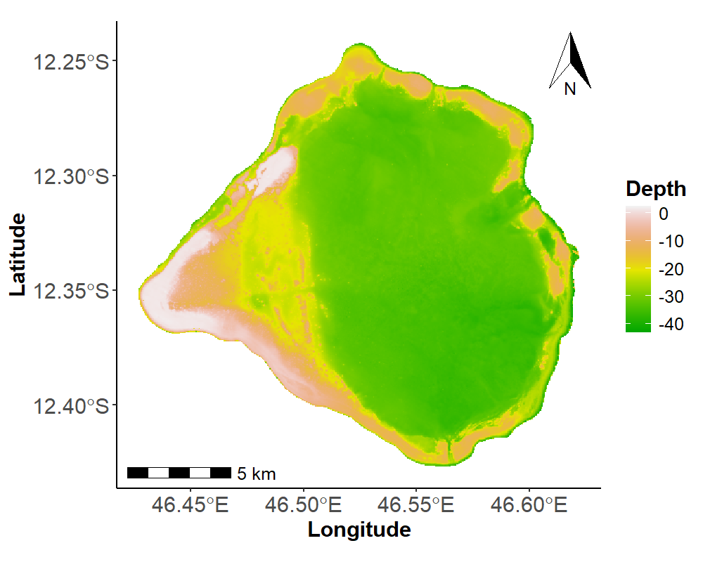
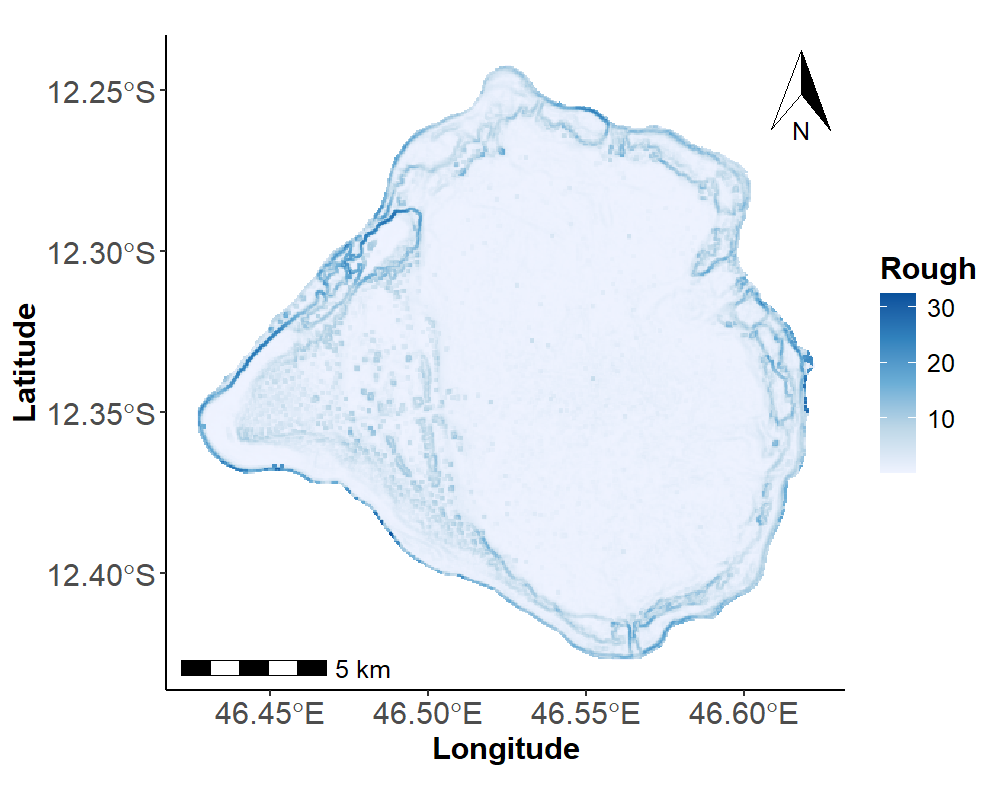
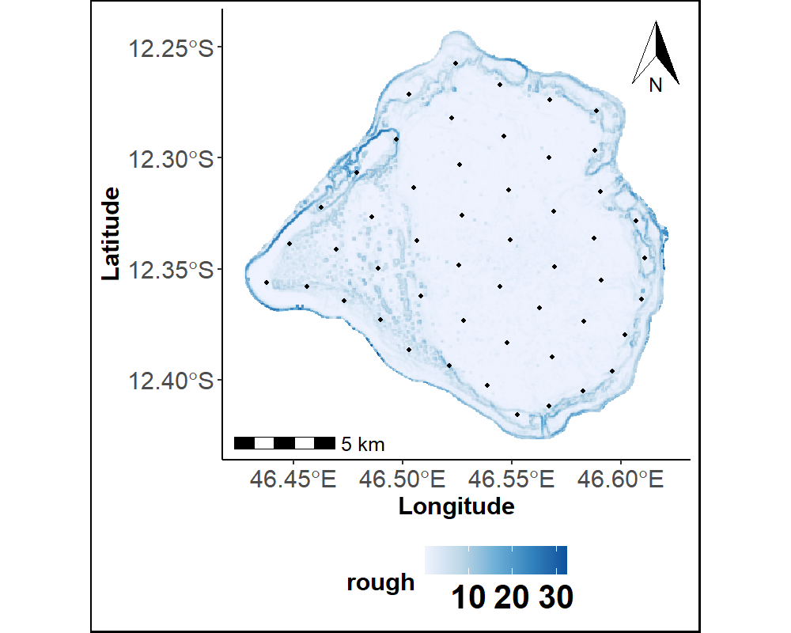
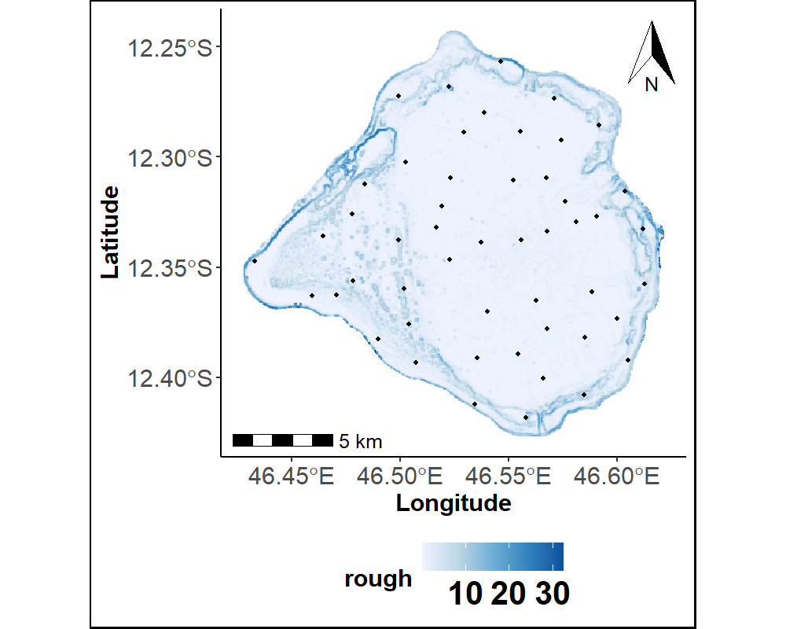

```{=html}
<style>
nav.navbar{display:none !important}
body.nav-fixed{padding-top:0 !important}
.lang-python{display:none}
body[data-lang="python"] .lang-r{display:none}
body[data-lang="python"] .lang-python{display:block}

:root{--lr-r:#E08767;--lr-py:#5B8FE8}
body.quarto-light{--lr-r:#C4643F;--lr-py:#2F63C7}
.langtoggle{position:sticky;top:12px;z-index:40;display:inline-flex;padding:4px;border-radius:999px;background:rgba(127,127,127,.1);border:1px solid rgba(127,127,127,.22);box-shadow:0 8px 20px -12px rgba(0,0,0,.35);margin:18px 0 26px}
.langtoggle-indicator{position:absolute;top:4px;bottom:4px;left:4px;width:calc(50% - 4px);border-radius:999px;background:var(--bs-body-bg,#fff);box-shadow:0 2px 8px rgba(0,0,0,.18);transition:transform .28s cubic-bezier(.22,.8,.32,1);z-index:0}
.langtoggle button{position:relative;z-index:1;border:none;background:transparent;padding:8px 24px;border-radius:999px;font-size:13.5px;font-weight:600;cursor:pointer;color:inherit;opacity:.55;transition:opacity .2s;display:inline-flex;align-items:center;gap:8px}
.langtoggle button::before{content:"";width:7px;height:7px;border-radius:50%;flex:none}
.langtoggle button[data-lang="r"]::before{background:var(--lr-r)}
.langtoggle button[data-lang="python"]::before{background:var(--lr-py)}
.langtoggle button[aria-pressed="true"]{opacity:1}
</style>
<script>
document.addEventListener("DOMContentLoaded", function(){
  var h = window.location.hash.replace("#","").toLowerCase();
  var initial = h==="python" ? "python" : "r";
  var indicator = document.getElementById("langIndicator");
  var buttons = document.querySelectorAll(".langtoggle button");
  function setLang(lang){
    document.body.setAttribute("data-lang", lang);
    buttons.forEach(function(b){ b.setAttribute("aria-pressed", b.getAttribute("data-lang")===lang); });
    indicator.style.transform = lang==="python" ? "translateX(100%)" : "translateX(0)";
  }
  buttons.forEach(function(b){
    b.addEventListener("click", function(){ setLang(b.getAttribute("data-lang")); });
  });
  setLang(initial);
});
</script>
```

[← Retour aux tutoriels](../../tutoriels.qmd)

## Le problème

Choisir où échantillonner sur le terrain n'est pas anodin : un tirage aléatoire simple peut sur-représenter certaines zones et en laisser d'autres complètement absentes, surtout quand la zone d'étude est irrégulière. Il faut un plan d'échantillonnage qui garantisse une **couverture spatiale homogène** — ou, mieux encore, qui concentre l'effort là où le terrain est le plus complexe, donc le plus difficile à prédire.

Le code et les fonctions utilisées ici sont ceux employés pour constituer les données d'entraînement du modèle décrit dans [« Cartographie grande échelle »](../../projets.qmd) sur la page Travaux, appliqués à une zone récifale réelle (le banc du Geyser, à Mayotte). Choisissez le langage qui vous intéresse ci-dessous.

```{=html}
<div class="langtoggle" role="group" aria-label="Choisir le langage">
<span class="langtoggle-indicator" id="langIndicator"></span>
<button type="button" data-lang="r" aria-pressed="true">R</button>
<button type="button" data-lang="python" aria-pressed="false">Python</button>
</div>
```

::: {.callout-note title="En bref"}
- **SCS-KMeans** : k-means sur les coordonnées d'une grille régulière — couverture uniforme, les points échantillonnés sont les centres des clusters.
- **SCS-médoïde** : même objectif, mais chaque point échantillonné est une vraie cellule du terrain (son médoïde), pas un centre calculé — c'est l'algorithme CLARA/PAM en R.
- **CD-médoïde** *(complexity-dependent)* : le clustering se fait sur la profondeur et la rugosité du terrain plutôt que sur les coordonnées — l'échantillonnage se concentre là où le relief est le plus complexe.
:::

## La méthode

Le terrain est décrit par un raster réel à 50 m de résolution (profondeur et rugosité, entre autres variables), sur lequel les trois méthodes sont appliquées.

::: {.lang-block .lang-r}

::: {.callout-tip collapse="true" title="Prérequis techniques"}
Packages R : `raster`, `terra`, `sf`, `sp`, `ggplot2`, `ggspatial`, `ggnewscale`. Les fonctions `scsKM`, `scsCLARA`, `cdCLARA` et `plotPoints` sont publiées séparément sur Zenodo.

[<i class="bi bi-box-arrow-up-right"></i> Fonctions sur Zenodo](https://doi.org/10.5281/zenodo.8436795){.btn .btn-outline-primary role="button" target="_blank"}
:::

```r
library(raster)
library(sf)
library(ggplot2)
library(ggspatial)
library(ggnewscale)

source("scs-kmeans.R")   # scsKM()   : k-means sur les coordonnées
source("scs-clara.R")    # scsCLARA(): médoïdes (CLARA) sur les coordonnées
source("cd-clara.R")     # cdCLARA() : médoïdes (CLARA) sur profondeur + rugosité
source("sample-points-plot.R")

# Raster réel du terrain (50 m de résolution) : profondeur, rugosité, ...
Terrain_Attr_50 <- terra::rast("50m_rast_Attr2.tif")
Terrain_Attr_50_df <- as.data.frame(Terrain_Attr_50, xy = TRUE)
names(Terrain_Attr_50_df) <- append(c("Longitude", "Latitude"), all_predicteurs)

Depth_plot <- ggplot(shp2) +
  geom_sf(fill = NA, color = NA) +
  geom_tile(data = Terrain_Attr_50_df, aes(Longitude, Latitude, fill = Prof_Moyenne)) +
  scale_fill_gradientn(colours = terrain.colors(100), na.value = "white", name = "Depth")

Roughness_plot <- ggplot(shp2) +
  geom_sf(fill = NA, color = NA) +
  geom_tile(data = Terrain_Attr_50_df, aes(Longitude, Latitude, fill = rough)) +
  scale_fill_gradientn("Rough", colours = RColorBrewer::brewer.pal(5, "Blues"), na.value = "gray")
```

::: {layout-ncol="2"}



:::

Ces deux variables — profondeur et rugosité — décrivent la complexité du relief : c'est sur elles que se base l'échantillonnage CD-médoïde, alors que SCS-KMeans et SCS-médoïde ignorent le relief et ne considèrent que la position géographique.

:::

::: {.lang-block .lang-python}

::: {.callout-tip collapse="true" title="Prérequis techniques"}
Seuls `numpy`, `matplotlib` et `scikit-learn` sont nécessaires. Le raster source est un GeoTIFF multi-bandes compressé LZW, illisible par les librairies géospatiales habituelles indisponibles ici (`rasterio`, `GDAL`) — un petit lecteur TIFF/LZW pur Python s'en charge à la place. Code complet : [`terrain_reader.py`](terrain_reader.py), [`sampling.py`](sampling.py).
:::

```{python}
#| label: methode
import sys
sys.path.insert(0, ".")
import numpy as np
import matplotlib.pyplot as plt
from terrain_reader import read_tiff_bands

# Raster réel du terrain (50 m de résolution, 9 bandes) : bande 0 = profondeur, bande 1 = rugosité
bands = read_tiff_bands("50m_rast_Attr2.tif")
depth, rough = bands[0], bands[1]
H, W = depth.shape

yy, xx = np.mgrid[0:H, 0:W]
X, Y = xx * 50.0, yy * 50.0  # coordonnées relatives, en mètres (résolution 50 m)

valid = ~np.isnan(depth) & ~np.isnan(rough)
coords = np.column_stack([X[valid], Y[valid]])
complexity = np.column_stack([depth[valid], rough[valid]])
```

```{python}
#| label: fig-methode
#| fig-cap: "Profondeur et rugosité du terrain réel (banc du Geyser)"
#| code-fold: true
fig, axes = plt.subplots(1, 2, figsize=(9, 4))
sc0 = axes[0].scatter(X[valid], Y[valid], c=depth[valid], cmap="terrain", s=2)
axes[0].set_title("Profondeur", fontsize=10)
fig.colorbar(sc0, ax=axes[0], shrink=0.8)
sc1 = axes[1].scatter(X[valid], Y[valid], c=rough[valid], cmap="Blues", s=2)
axes[1].set_title("Rugosité", fontsize=10)
fig.colorbar(sc1, ax=axes[1], shrink=0.8)
for ax in axes:
    ax.set_aspect("equal"); ax.set_xlabel("X (m)"); ax.set_ylabel("Y (m)")
fig.tight_layout()
plt.show()
```

:::

## Les résultats

Les trois méthodes sont appliquées à la même zone, avec le même nombre de points échantillonnés (K = 50), mais des critères différents : couvrir uniformément l'espace, ou se concentrer sur le relief complexe.

::: {.lang-block .lang-r}

```r
pvtscskm <- scsKM(shp = Geyser_bathy, var = c("Longitude", "Latitude"),
                   iter = 12, sampsize = 50, nT = 10)

pvtscscl <- scsCLARA(data = Terrain_Attr_50_df, var = c("Longitude", "Latitude"),
                      iter = 1, sampsize = 50, disT = "euclidean")

pvtcdcl <- cdCLARA(data = Terrain_Attr_50_df, var1 = c("Longitude", "Latitude"),
                    var2 = c("Prof_Moyenne", "rough"), iter = 12, sampsize = 50, disT = "manhattan")
```

::: {layout-ncol="3"}





:::

Les deux premières méthodes produisent une grille de points régulièrement espacés sur toute la zone. La troisième s'en écarte nettement : les points se resserrent le long des bords, là où la rugosité est la plus forte.

:::

::: {.lang-block .lang-python}

```{python}
#| label: sampling
from sklearn.cluster import KMeans
from sampling import kmeans_medoids

K = 50

scs_kmeans_pts = KMeans(n_clusters=K, random_state=12, n_init=10).fit(coords).cluster_centers_
scs_medoid_pts, _ = kmeans_medoids(coords, coords, K, seed=12)
cd_medoid_pts, _ = kmeans_medoids(complexity, coords, K, seed=12)

print("SCS-KMeans  :", scs_kmeans_pts.shape[0], "points")
print("SCS-médoïde :", scs_medoid_pts.shape[0], "points")
print("CD-médoïde  :", cd_medoid_pts.shape[0], "points")
```

```{python}
#| label: fig-sampling
#| fig-cap: "Points échantillonnés par les trois méthodes, sur fond de rugosité"
#| code-fold: true
fig, axes = plt.subplots(1, 3, figsize=(13, 4.2))
for ax, pts, title in zip(axes, [scs_kmeans_pts, scs_medoid_pts, cd_medoid_pts],
                           ["SCS-KMeans", "SCS-médoïde", "CD-médoïde"]):
    ax.scatter(X[valid], Y[valid], c=rough[valid], cmap="Blues", s=2, alpha=0.6)
    ax.scatter(pts[:, 0], pts[:, 1], c="#E08767", s=14, edgecolor="black", linewidth=0.4)
    ax.set_title(title, fontsize=10)
    ax.set_aspect("equal"); ax.set_xticks([]); ax.set_yticks([])
fig.tight_layout()
plt.show()
```

:::

Les deux premières méthodes produisent une grille de points régulièrement espacés sur toute la zone. La troisième s'en écarte nettement : les points se resserrent le long des bords, là où la rugosité est la plus forte.

::: {.callout-tip title="Détail : ce que minimise le k-means"}
$$
MSSD = \frac{1}{N}\sum_{i=1}^{N} \min_{k} \lVert x_i - c_k \rVert^2
$$

où $x_i$ sont les cellules du terrain et $c_k$ les $K$ points échantillonnés : le k-means choisit les $c_k$ qui minimisent la distance quadratique moyenne au point échantillonné le plus proche — d'où la couverture régulière. **SCS-médoïde** et **CD-médoïde** reprennent ce même critère, mais imposent en plus que chaque $c_k$ soit une cellule réelle du terrain (un médoïde), pas un centre recalculé.
:::

## Testez par vous-même

Le calcul réel ci-dessus porte sur plus de 100 000 cellules — trop pour un navigateur. Voici la même idée sur un petit nuage de 16 points en 2D, regroupés en 3 amas visibles à l'œil nu : modifiez `k` et cliquez sur *Exécuter* pour voir quels points sont retenus comme échantillons.

::: {.callout-warning}
Version simplifiée à but pédagogique, sur un exemple jouet — le calcul réel sur les données complètes est celui de la section précédente.
:::

::: {.lang-block .lang-r}

::: {.callout-note title="Ce que fait ce code"}
16 points 2D sont regroupés en `k` amas : l'algorithme alterne entre l'affectation de chaque point au centre le plus proche et le recalcul des centres, jusqu'à convergence — puis retient, pour chaque amas, le point réellement observé le plus proche de son centre (le médoïde), plutôt que le centre lui-même qui n'est en général pas un point du jeu de données. Changez `k` et relancez pour voir le découpage en amas s'adapter.
:::

```{webr}
pts <- matrix(c(
  1,1, 1,3, 2,2, 4,1, 4,3, 5,2,
  8,8, 8,10, 9,9, 11,8, 11,10, 12,9,
  2,8, 3,9, 8,2, 9,3
), ncol = 2, byrow = TRUE)

k <- 3

kmeans_medoids <- function(pts, k, iters = 20) {
  set.seed(1)
  centers <- pts[sample(nrow(pts), k), , drop = FALSE]
  for (it in 1:iters) {
    d <- as.matrix(dist(rbind(centers, pts)))[1:k, (k + 1):(k + nrow(pts)), drop = FALSE]
    labels <- apply(d, 2, which.min)
    for (c in 1:k) {
      idx <- which(labels == c)
      if (length(idx) > 0) centers[c, ] <- colMeans(pts[idx, , drop = FALSE])
    }
  }
  d <- as.matrix(dist(rbind(centers, pts)))[1:k, (k + 1):(k + nrow(pts)), drop = FALSE]
  labels <- apply(d, 2, which.min)
  medoids <- integer(0)
  for (c in 1:k) {
    idx <- which(labels == c)
    if (length(idx) == 0) next
    dd <- sqrt(rowSums((pts[idx, , drop = FALSE] - matrix(centers[c, ], length(idx), 2, byrow = TRUE))^2))
    medoids <- c(medoids, idx[which.min(dd)])
  }
  pts[medoids, , drop = FALSE]
}

cat("Points échantillonnés :\n")
print(kmeans_medoids(pts, k))
```

:::

::: {.lang-block .lang-python}

::: {.callout-note title="Ce que fait ce code"}
16 points 2D sont regroupés en `k` amas : l'algorithme alterne entre l'affectation de chaque point au centre le plus proche et le recalcul des centres, jusqu'à convergence — puis retient, pour chaque amas, le point réellement observé le plus proche de son centre (le médoïde), plutôt que le centre lui-même qui n'est en général pas un point du jeu de données. Changez `k` et relancez pour voir le découpage en amas s'adapter.
:::

```{pyodide}
import numpy as np

pts = np.array([
    [1,1],[1,3],[2,2],[4,1],[4,3],[5,2],
    [8,8],[8,10],[9,9],[11,8],[11,10],[12,9],
    [2,8],[3,9],[8,2],[9,3],
], dtype=float)

k = 3

def kmeans_medoids(pts, k, iters=20, seed=1):
    rng = np.random.default_rng(seed)
    centers = pts[rng.choice(len(pts), k, replace=False)].copy()
    for _ in range(iters):
        d = np.linalg.norm(pts[:, None, :] - centers[None, :, :], axis=2)
        labels = d.argmin(axis=1)
        for c in range(k):
            idx = np.where(labels == c)[0]
            if len(idx) > 0:
                centers[c] = pts[idx].mean(axis=0)
    d = np.linalg.norm(pts[:, None, :] - centers[None, :, :], axis=2)
    labels = d.argmin(axis=1)
    medoids = []
    for c in range(k):
        idx = np.where(labels == c)[0]
        if len(idx) == 0:
            continue
        dd = np.linalg.norm(pts[idx] - centers[c], axis=1)
        medoids.append(idx[np.argmin(dd)])
    return pts[medoids]

print("Points échantillonnés :")
print(kmeans_medoids(pts, k))
```

:::

## Pour aller plus loin

:::: {.d-flex .gap-2 .flex-wrap style="margin:14px 0 28px"}
[<i class="bi bi-github"></i> Code R sur GitHub](https://github.com/latsouckfaye/SpatialSampling){.btn .btn-outline-secondary role="button" target="_blank"}
[<i class="bi bi-github"></i> Code Python sur GitHub](https://github.com/latsouckfaye/SpatialSampling/tree/main/python){.btn .btn-outline-secondary role="button" target="_blank"}
[<i class="bi bi-box-arrow-up-right"></i> Fonctions sur Zenodo](https://doi.org/10.5281/zenodo.8436795){.btn .btn-outline-primary role="button" target="_blank"}
[<i class="bi bi-door-open"></i> Voir le projet « Cartographie grande échelle »](../../projets.qmd){.btn .btn-outline-secondary role="button"}
[<i class="bi bi-door-open"></i> Retour aux tutoriels](../../tutoriels.qmd){.btn .btn-outline-secondary role="button"}
::::

Ces méthodes d'échantillonnage ont servi à constituer les données d'entraînement du modèle de cartographie géomorphologique automatique décrit dans @FaDa2024.

::: {#refs}
:::
